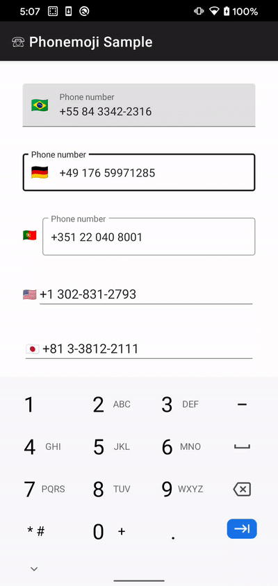

[](https://jitpack.io/#tfcporciuncula/phonemoji)
[](https://github.com/tfcporciuncula/phonemoji/actions?query=workflow%3ACI)
[](https://ktlint.github.io/)

# ☏ phonemoji

Phonemoji provides a flexible text input field implementation that formats international phone numbers as you type and displays the flag of the country that matches the number's country code. It's powered by [libphonenumber](https://github.com/google/libphonenumber) (or its [Android port](https://github.com/MichaelRocks/libphonenumber-android) to be more precise), compatible with [Material Components](https://github.com/material-components/material-components-android), and based on [`PhoneNumberFormattingTextWatcher`](https://developer.android.com/reference/android/telephony/PhoneNumberFormattingTextWatcher).



🙃 Flags are emoji, so no extra resources are required. Also, they look cute.

👉 Flags are not tappable -- there's no list with all the country codes or anything like that.

🚩 The flag is updated as the phone number is entered and formatted. It updates as soon as the country code is identified, and it only changes again if a different valid country code is entered.

➕ It only supports international numbers, so the plus sign is always there and can't be removed. It's still part of the input, though, so you can still move the cursor before the sign. If you do that and input a character, the input will be entered after the plus sign.

## Download

```groovy
repositories {
  maven { url "https://jitpack.io" }
}

dependencies {
  implementation 'com.github.tfcporciuncula:phonemoji:1.0.1'
}
```

## Usage

The library offers a [`TextInputEditText`](https://developer.android.com/reference/com/google/android/material/textfield/TextInputEditText) and a [`TextInputLayout`](https://developer.android.com/reference/com/google/android/material/textfield/TextInputLayout) implementation. When you put them together, the `TextInputLayout` renders the flag as a [`startIconDrawable`](https://developer.android.com/reference/com/google/android/material/textfield/TextInputLayout#setStartIconDrawable(android.graphics.drawable.Drawable)) based on the `TextInputEditText` input:

```xml
<com.tfcporciuncula.phonemoji.PhonemojiTextInputLayout
  style="@style/Widget.MaterialComponents.TextInputLayout.OutlinedBox"
  android:layout_width="match_parent"
  android:layout_height="wrap_content"
  android:hint="@string/phone_number"
  >

  <com.tfcporciuncula.phonemoji.PhonemojiTextInputEditText
    android:layout_width="match_parent"
    android:layout_height="match_parent"
    />

</com.tfcporciuncula.phonemoji.PhonemojiTextInputLayout>
```


- The flag visibility and size can be set with the attributes `phonemoji_showFlag` and `phonemoji_flagSize`.
- The field is never empty. By default, it starts with `+XX`, where `XX` is the country calling code for the network country (from [`TelephonyManager`](https://developer.android.com/reference/android/telephony/TelephonyManager#getNetworkCountryIso())) or for the country from the default [`Locale`](https://developer.android.com/reference/java/util/Locale#getDefault(java.util.Locale.Category)) in case the network country doesn't resolve to a valid country code.
- The initial country code can also be set with the attributes `phonemoji_initialRegionCode` (e.g. `US` for `1`) and `phonemoji_initialCountryCode` (e.g. `1` for the `US`) or through `setRegionCode()` and `setCountryCode()`.

If you don't want to work with a `TextInputLayout`, or if you don't want to render the flag as the start icon there, you can use a `PhonemojiFlagTextView` to render the flag anywhere you place it. You can "connect" it with the `TextInputEditText` by referencing it in the `phonemoji_flagFor` attribute like this:

```xml
<LinearLayout
  android:layout_width="match_parent"
  android:layout_height="wrap_content"
  android:orientation="horizontal"
  >

  <com.tfcporciuncula.phonemoji.PhonemojiFlagTextView
    android:layout_width="wrap_content"
    android:layout_height="wrap_content"
    android:gravity="center"
    android:textSize="16sp"
    app:phonemoji_flagFor="@id/phonemojiTextInputEditText"
    />

  <com.tfcporciuncula.phonemoji.PhonemojiTextInputEditText
    android:id="@+id/phonemojiTextInputEditText"
    android:layout_width="match_parent"
    android:layout_height="wrap_content"
    app:phonemoji_initialRegionCode="BR"
    />

</LinearLayout>
```


🙆‍♂️
